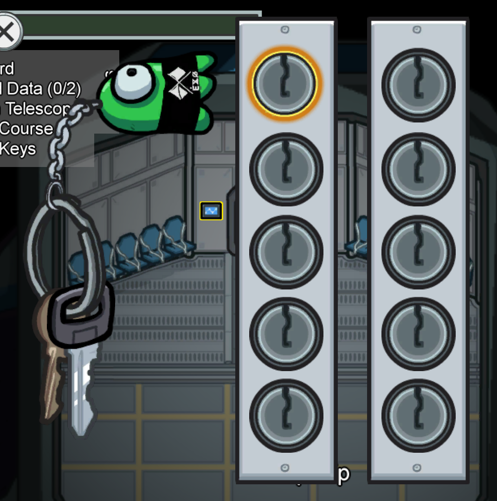

# EXO-MOD-FOR-AMONG-US
This is a fanmade Among Us mod for EXO fans. I do not claim any right over the game. I only made some modifications in the original assets files. I also do not claim any right over EXO. This is only a fanmade mod. All rights reserved to the respective copyright owners.

## SOME OF THE CHANGES

### Menu

### Map

### Accessories

### Buttons

### Missions

### Other Changes

* "Imposter" was updated to "X EXO-L"
* "Tripulant" was updated to "EXO-L"

## IMPORTANT FIRST STEP
Before putting the mod in your game:
1. Go to your Among Us data folder.
2. Copy the "globalgamesmanagers.assets" and "sharedassets0.assets" files.
3. Paste them in a safe place.
(this is important in case the mod creates problems in your game)

## PUTTING THE MOD IN YOUR GAME
How to put the mod in your game:
1. Copy the files from the "Files to replace" folder.
2. Go to your Among Us data folder.
3. Paste the files there. (They will replace the original "globalgamesmanagers.assets" and "sharedassets0.assets" files)
And you're ready to play!!

## WHAT TO DO IF THERE ARE CONFLICTS
What to do if the mod creates problems in your game:
1. Go to the "safe place" where you saved the original game files.
2. "globalgamesmanagers.assets" and "sharedassets0.assets" files.
3. Go to your Among Us data folder.
4. Paste the files there. (They will replace the modded "globalgamesmanagers.assets" and "sharedassets0.assets" files)

Note: If this happens, it's probably because the mod was made for a different version of the game.
Once I notice that the version is different, I'll do an updated version of the mod.

## WHERE TO CONTACT ME
* Github: martamribeiro
* Email: martammrib@gmail.com

## NOTES
I do not claim any right over the game. I only made some modifications in the original files.
I also do not claim any right over EXO. This is only a fanmade mod.
All rights reserved to the respective copyright owners.
